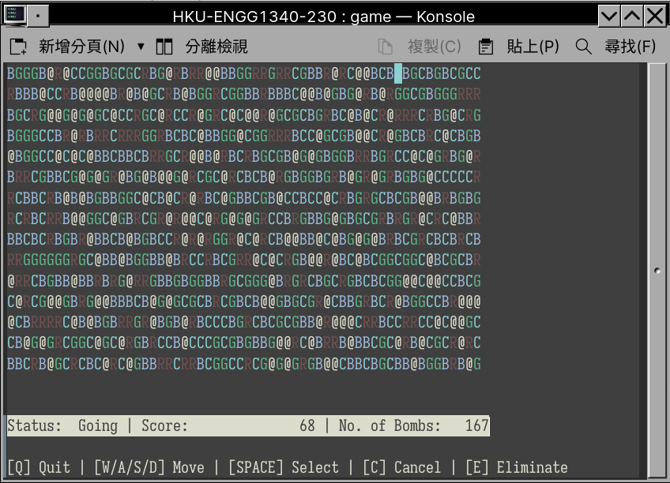

<h1 align="center">Happy Eliminating</h1>

## Team Members

|Name|UID|GitHub|
|-|-|-|
|YANG Mingtian|3035845576|[skylee03](https://github.com/skylee03)|
|TU Huaqiang|3035772834|[Hawk-Tu](https://github.com/Hawk-Tu)|

## Screenshot

## Game Description

- Initially, the board is filled with balloons in 4 different colors and bombs.
- The player can eliminate three or more 8-connected balloons with the same color by selecting a not self-intersected path within the board. Once a balloon is eliminated, the bombs (if any) that are 8-connected with it will also be eliminated. If  is the number of balloons eliminated in one turn, the total score will be increased by .
- However, if no bombs are eliminated after the operation, the score will not be increased, and a random balloon will be replaced with a bomb.
- After every operation, the vacancies will be filled with newly generated balloons.
- The player wins the game in case all the bombs are wliminated, and the leaderboard will be updated automatically.

## Game Features

1. Generation of random game sets or events
   - All the balloons and bombs are randomly generated.
2. Data structures for storing game status
   - class `Map`: store the content of the board and game status.
   - class `Leaderboard`: store the leaderboard.
3. Dynamic memory management
   - We use the `new` operator to allocate memory for the class objects and then call their object constructors. Pointers are used to store these memory addresses. Hence, when the game is over, we can use the `delete` operator to deallocate the memory allocated with the `new` operator.
4. File input/output (e.g., for loading/saving game status)
   - After winning the game, the leaderboard will be updated automatically with the final score and the time. All the records will be saved in `log/leaderboard.txt`.
   - The player can also choose to reset the leaderboard.
5. Program codes in multiple files
   - `./src` includes the source files:
     - `main.cpp`: The entrance of the game.
     - `interaction.cpp/.h`: Interaction-related code, including interface painting and keyboard events handling.
     - `leaderboard.cpp/.h`: Definition and implementation of class `Leaderboard`.
     - `map.cpp/.h`: Definition and implementation of class `Map`.
     - `fileio.cpp/.h`: Codes related to File Input/Output.
     - `constants.h`: Definition of constants.
6. Proper indentation and naming styles
   - We mainly follow the [Google C++ Style Guide](https://google.github.io/styleguide/cppguide.html) but with some appropriate adjustments according to preferences.
7. In-code documentation

## External Libraries

We use [`ncurses`](https://invisible-island.net/ncurses/) to visualize the game as well as to accept inputs from both the keyboard and the mouse.

## Compilation & Execution Instructions

- Download & install the `ncurses` library: `make ncurses`
- Compile & generate executable: `make all`
- Execute the game: `./bin/game`
- Remove the build and log files: `make clean clean-log`

Compilation has been tested on `academy11` server.

## Game Instructions

Simply follow the instructions in the game interface.

## Video

